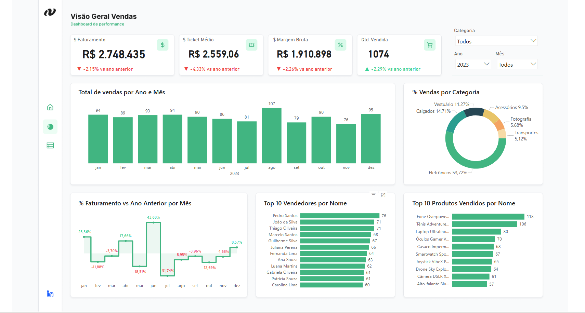
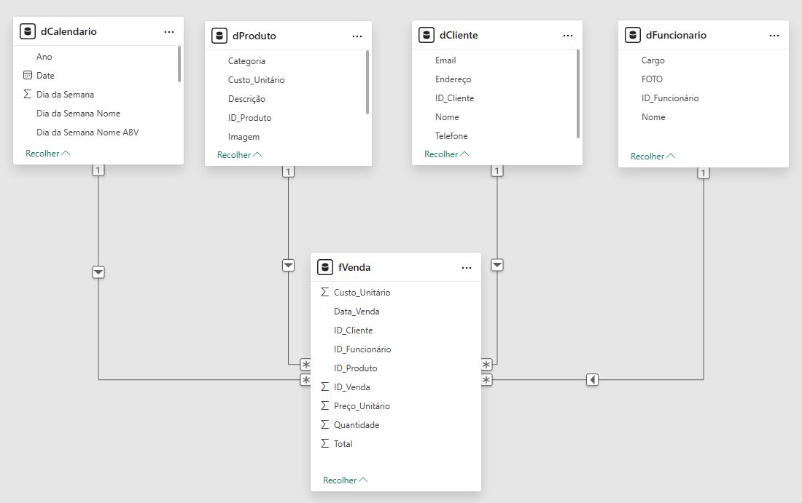

# 📊 Dashboard de Vendas

Este projeto consiste em um dashboard de análise de vendas, desenvolvido integralmente no Power BI. O objetivo é consolidar os principais indicadores de performance (KPIs) e fornecer uma visão interativa do desempenho comercial, comparando resultados com o ano anterior.

<!--  -->
## 🔗 Dashboard Interativo

Para uma melhor experiência e para testar a interatividade dos filtros e visuais, o dashboard está disponível publicamente no link abaixo:

**[Acesse o dashboard interativo aqui](https://app.powerbi.com/view?r=eyJrIjoiOGYxMmRiZDYtODEyNy00MjFkLTlhNTgtMzMzNDM2ZjZkZWYyIiwidCI6ImQ0MDY5MTM4LWE2MTAtNDFjOC1iZDhkLWM3OWEwZjdlZmJlOCJ9)**

## 📖 Contexto do Projeto

Este dashboard foi criado para atender às necessidades da área de gestão de vendas, respondendo a perguntas críticas de negócio:

  * Qual o desempenho atual do faturamento em comparação com o ano anterior?
  * A sazonalidade das vendas está seguindo o padrão esperado?
  * Quais categorias de produtos geram mais receita?
  * Quais produtos e vendedores estão no topo do ranking de performance?

## 🛠️ Arquitetura da Solução no Power BI

O projeto foi estruturado seguindo as boas práticas do Power BI, dividido em quatro etapas principais:

### 1\. Extração e Transformação (ETL) com Power Query

  * **Fontes de Dados:** Os dados foram importados da pasta base.
  * **Tratamento:** Foi utilizado o Power Query para realizar a limpeza e transformação dos dados. As etapas incluíram:
      * Remoção de valores nulos e duplicados.
      * Ajuste de tipos de dados (ex: formatação de datas e valores monetários).
      * Mesclagem de tabelas (ex: união da tabela de Vendas com a de Produtos).
      * Criação de uma tabela **dCalendário** (dimensão de data) robusta via linguagem M.

### 2\. Modelagem de Dados (Esquema Estrela)

Foi implementado um **Esquema Estrela** (Star Schema) para otimizar a performance das consultas DAX.

  * **Tabela Fato:** `fVendas` (contendo chaves estrangeiras, quantidade, valor, etc.)
  * **Tabelas de Dimensão:**
      * `dCalendario` (conectada à `fVendas` pela data)
      * `dProduto` (conectada pela `ID_Produto`, contém Categoria e Nome do Produto)
      * `dFuncionario` (conectada pela `ID_Vendedor`)
      * `dCliente` (conectada pela `ID_Cliente`)

<!--  -->
### 3\. Cálculos e Medidas (DAX)

Todas as métricas de negócio foram criadas usando **DAX (Data Analysis Expressions)** para garantir cálculos dinâmicos e precisos. As principais medidas incluem:

  * **KPIs Básicos:**

      * `$ Faturamento = SUMX( fVenda, fVenda[Quantidade] * fVenda[Preço_Unitário] )`
      * `Qtd. Vendida = COUNTROWS(fVenda)`
      * `$ Margem Bruta = [$ Faturamento] - [$ Custo Total]`
      * `% Margem Bruta = DIVIDE( [$ Margem Bruta], [$ Faturamento] )`
      * `$ Ticket Médio = DIVIDE( [$ Faturamento], Qtd. Vendida )`
      * `$ Custo Total = SUMX( fVenda, fVenda[Custo_Unitário] * fVenda[Quantidade] )`

  * **Medidas de Inteligência de Tempo (Time Intelligence):**

      * `[Faturamento Ano Anterior] = CALCULATE( [$ Faturamento], SAMEPERIODLASTYEAR(dCalendário[Date]) )`
      * `% Faturamento vs Ano Anterior = DIVIDE( ([$ Faturamento] - [Faturamento Ano Anterior]), [Faturamento Ano Anterior] )`
      * (Medidas similares foram criadas para Ticket Médio, Margem e Quantidade)

  * **Medidas de Ranking** `RANKX` foram usadas para filtrar dinamicamente os visuais de "Top 10 Vendedores" e "Top 10 Produtos":

      * `Ranking Vendedos = RANKX( ALL( dFuncionario[Nome] ), dFuncionario[Nome] )`
      * `Ranking Produtos = RANKX( ALL( dProduto[Nome] ), dProduto[Nome] )`

### 4\. Visualização de Dados (Relatório)

O relatório foi construído em uma única página para uma "Visão Geral", contendo:

  * **Cards de KPIs:** 4 cartões (Faturamento, Ticket Médio, Margem Bruta, Qtd. Vendida) com indicadores de performance percentual vs. ano anterior.
  * **Gráfico de Linha:** `% Faturamento vs Ano Anterior por Mês`
  * **Gráfico de Colunas:** `Total de Vendas por Ano e Mês`
  * **Gráfico de Rosca:** `% Vendas por Categoria`
  * **Gráficos de Barras (Top N):** `Top 10 Vendedores` e `Top 10 Produtos Vendidos`.
  * **Filtros (Slicers):** Filtros interativos de `Categoria`, `Ano` e `Mês`.

## 🚀 Como Usar o Arquivo .pbix

Para explorar o modelo de dados, as consultas do Power Query e todas as medidas DAX:

1.  **Requisito:** Você precisa ter o **[Power BI Desktop](https://powerbi.microsoft.com/pt-br/desktop/)** instalado em sua máquina.
2.  **Download:** Baixe o arquivo `.pbix` deste repositório.
3.  **Abra o arquivo:** Abra o arquivo `.pbix` no Power BI Desktop.
4.  **Explore:**
      * Acesse a guia **"Exibição de Modelo"** (ícone de diagrama) para ver o Esquema Estrela.
      * Acesse a guia **"Exibição de Dados"** (ícone de tabela) para ver as tabelas.
      * Acesse **"Transformar dados"** na faixa de opções para abrir o Power Query e ver o ETL.
      * Clique nas medidas (na barra de "Dados" à direita) para ver o código DAX na barra de fórmulas.

## 🧑‍💻 Autor

**Jefferson Evangelista de Noronha**

  * [Linkedin](https://www.linkedin.com/in/jeffnoronha/)
  * [GitHub](https://github.com/jeffnoronha1)
